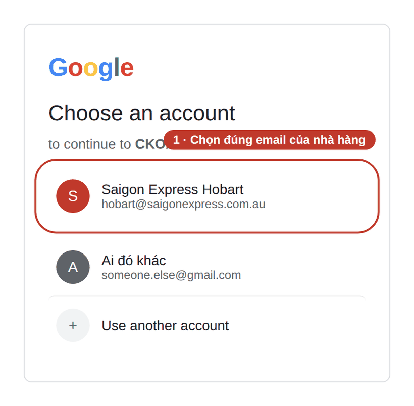
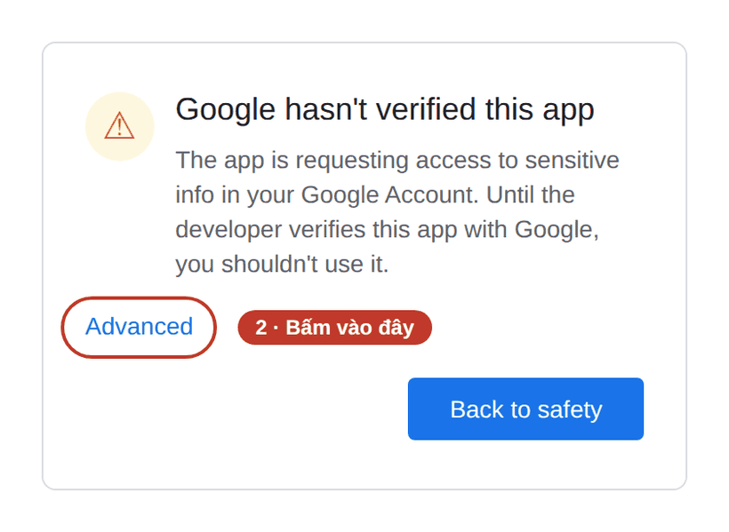
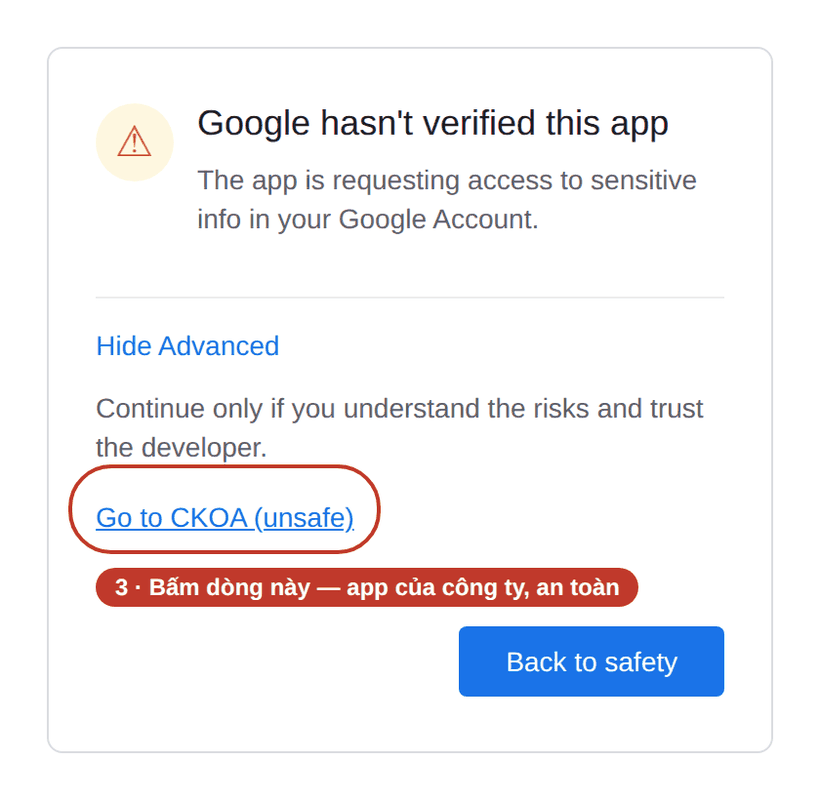
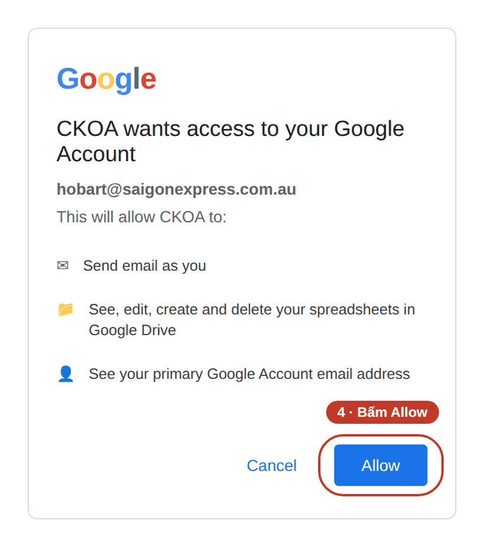
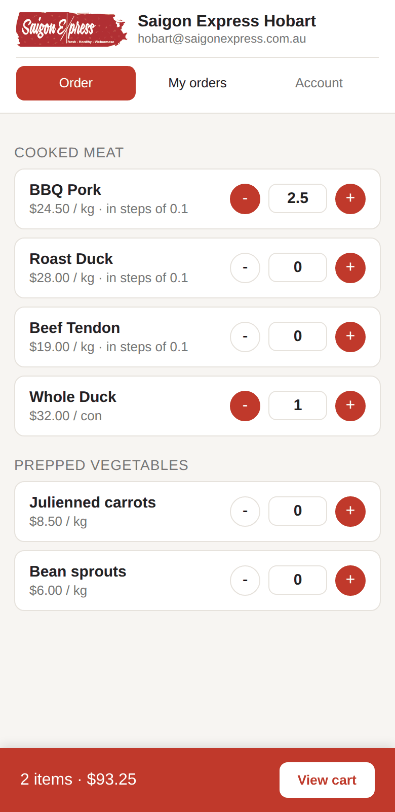
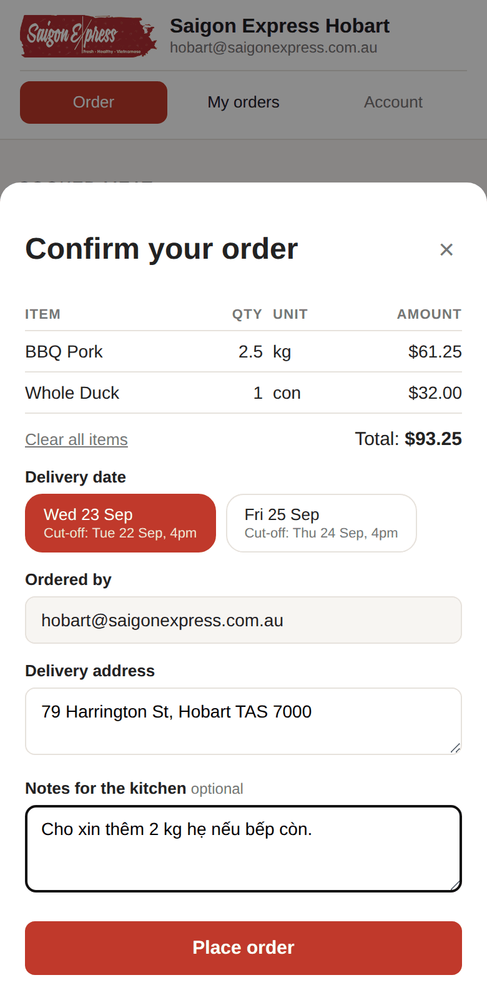
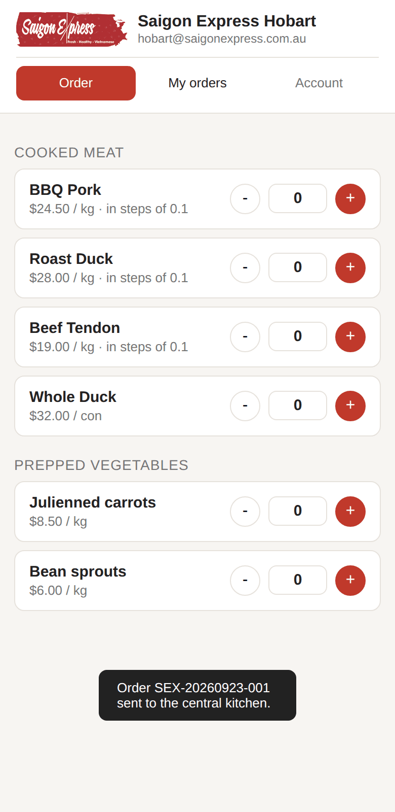
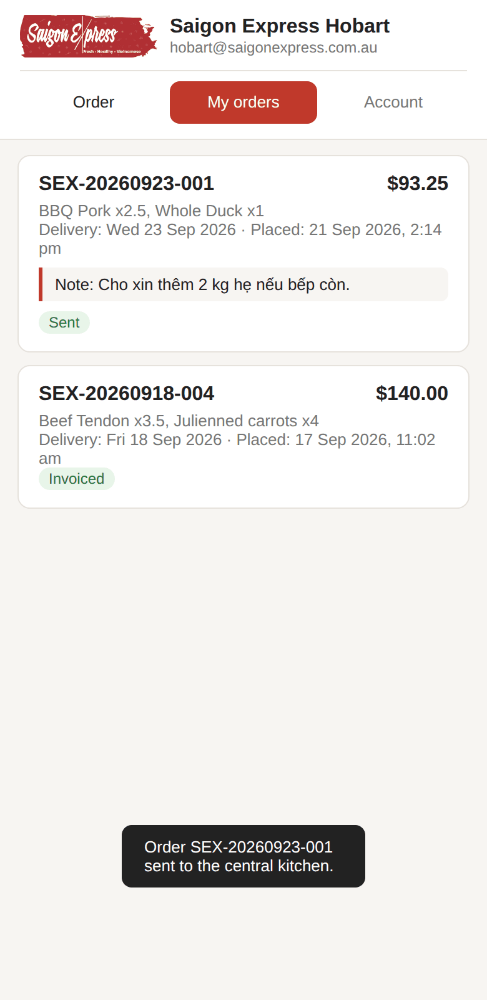
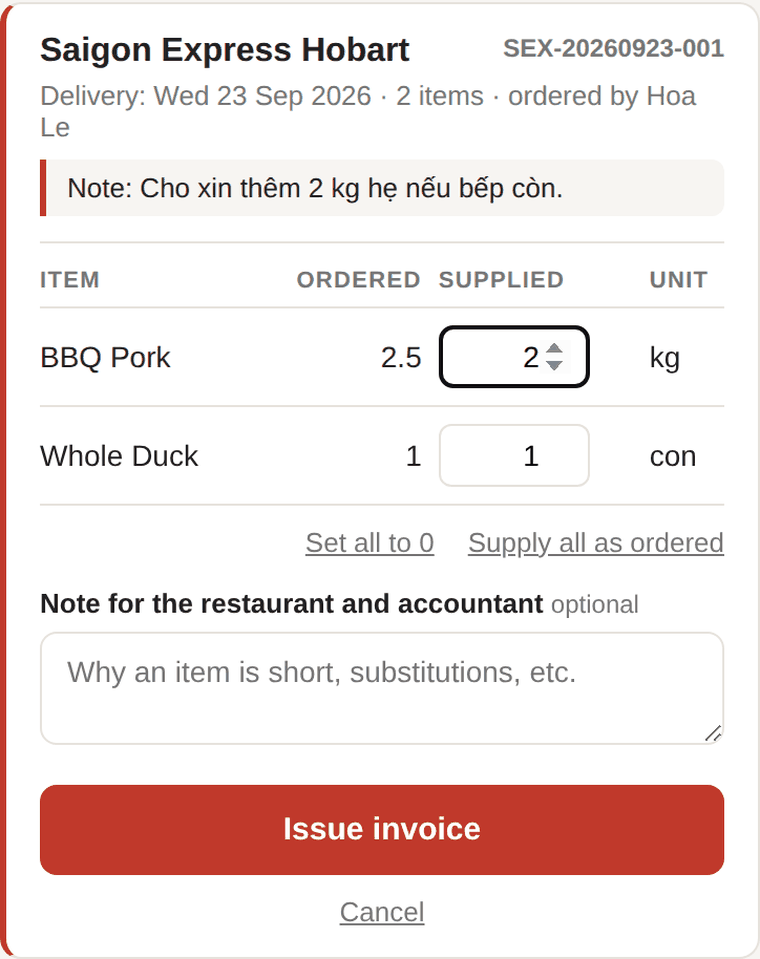

# Hướng dẫn sử dụng app đặt hàng

Dành cho **nhân viên nhà hàng** và **bếp trung tâm**. Không cần biết gì về máy tính, cứ làm theo từng bước.

App này thay cho việc nhắn tin hay gọi điện đặt hàng: bạn chọn món, bấm gửi, bếp trung tâm nhận được email ngay lập tức, và mọi đơn đều được lưu lại để đối chiếu sau này.

> **Bạn cần gì trước khi bắt đầu**
> - Link của app (quản lý gửi cho bạn — nên lưu lại)
> - Tài khoản Google của nhà hàng (email và mật khẩu)
>
> Mở được trên điện thoại, máy tính bảng hay máy tính đều được. Hướng dẫn này chụp trên điện thoại.

---

## Mục lục

- [Phần A — Lần đầu mở app](#phần-a--lần-đầu-mở-app)
- [Phần B — Đặt hàng](#phần-b--đặt-hàng)
- [Phần C — Xem lại đơn đã đặt](#phần-c--xem-lại-đơn-đã-đặt)
- [Phần D — Lỡ đăng nhập nhầm email](#phần-d--lỡ-đăng-nhập-nhầm-email)
- [Phần E — Dành riêng cho bếp trung tâm](#phần-e--dành-riêng-cho-bếp-trung-tâm)
- [Phần F — Gặp trục trặc thì làm gì](#phần-f--gặp-trục-trặc-thì-làm-gì)

---

## Phần A — Lần đầu mở app

Phần này **chỉ làm một lần duy nhất** cho mỗi điện thoại / máy tính. Những lần sau mở link là vào thẳng app.

Lần đầu Google sẽ hỏi vài câu và hiện **một màn hình cảnh báo trông khá đáng sợ**. Đây là chuyện bình thường với app do công ty tự viết — Google chưa "kiểm định" nó, chứ app không có gì nguy hiểm. Cứ làm theo 4 bước dưới đây.

> Bốn hình ở phần này là **hình minh hoạ** vẽ lại cho dễ nhìn. Màn hình thật của Google có thể khác một chút về chữ nghĩa và màu sắc, nhưng vị trí các nút thì giống vậy.

### Bước 1 — Bấm vào link, rồi chọn đúng email của nhà hàng

Nếu máy đang đăng nhập sẵn nhiều tài khoản Google, nhớ chọn **đúng email của nhà hàng mình**. Chọn nhầm thì app sẽ báo lỗi không vào được — xem [Phần D](#phần-d--lỡ-đăng-nhập-nhầm-email) để đổi lại.

### Bước 2 — Gặp màn hình cảnh báo, bấm **Advanced**

Đừng bấm **Back to safety** — bấm vào chữ **Advanced** nhỏ ở góc dưới bên trái.

### Bước 3 — Bấm dòng **Go to … (unsafe)**

Chữ *(unsafe)* nghe đáng sợ nhưng ở đây chỉ có nghĩa là "Google chưa kiểm định app này". Đây là app của chính công ty mình.

### Bước 4 — Bấm **Allow** để cho phép

Google hỏi app có được phép gửi email và ghi vào bảng tính hay không — đó chính là cách app gửi đơn cho bếp trung tâm và lưu lại đơn hàng. Bấm **Allow**.

Danh sách quyền hiện ra có thể dài ngắn khác nhau tuỳ máy, không sao cả.

✅ **Xong.** App mở ra và bạn đặt hàng được rồi. Từ lần sau, mở link là vào thẳng, không hỏi lại nữa.

### Nên làm: lưu app ra màn hình chính điện thoại

Để khỏi phải đi tìm link mỗi lần:

- **iPhone (Safari)**: bấm nút chia sẻ ⬆️ ở dưới màn hình → kéo xuống chọn **Add to Home Screen**
- **Android (Chrome)**: bấm nút ⋮ ở góc trên bên phải → chọn **Add to Home screen**

Sau đó app nằm trên màn hình chính như một ứng dụng bình thường.

---

## Phần B — Đặt hàng

### Bước 1 — Chọn món và số lượng

Bấm **+** và **−** để tăng giảm số lượng. Khi một món có số lượng lớn hơn 0, nút **−** sẽ chuyển sang màu đỏ — nhìn là biết ngay mình đã chọn món đó.

**Món bán theo ký đặt được số lẻ.** Những món ghi *"in steps of 0.1"* dưới giá (thường là các loại thịt đã nấu) cho phép đặt 0.5 kg, 1.3 kg, 2.5 kg… Với những món này:

> 💡 **Đừng bấm nút + hàng chục lần.** Muốn đặt 2.5 kg thì **bấm thẳng vào ô số lượng và gõ `2.5`**. Nhanh hơn rất nhiều.

Món nào không có dòng *"in steps of…"* (ví dụ Whole Duck — bán theo con) thì chỉ đặt được số nguyên: 1, 2, 3…

Ở dưới cùng màn hình luôn có thanh đỏ hiện **số món đã chọn** và **tổng tiền**. Bấm **View cart** để xem giỏ hàng.

### Bước 2 — Kiểm tra giỏ hàng và điền thông tin giao hàng

Trên màn hình này:

- **Bảng món** — kiểm tra lại số lượng và thành tiền. Bấm **Clear all items** nếu muốn bỏ hết làm lại từ đầu.
- **Delivery date (ngày giao)** — app chỉ hiện **2 ngày giao gần nhất** còn kịp đặt. Bấm vào ngày bạn muốn. Dòng chữ nhỏ *Cut-off* bên dưới là **hạn chót** đặt đơn cho ngày đó.
- **Ordered by (người đặt)** — app tự điền, bạn không phải gõ.
- **Delivery address (địa chỉ giao)** — app tự điền sẵn địa chỉ nhà hàng. Sửa lại nếu hôm đó cần giao chỗ khác.
- **Notes for the kitchen (ghi chú)** — không bắt buộc. Đây là chỗ để **xin những món không có trong danh sách**, hoặc dặn dò gì thêm. Ví dụ: *"Cho xin thêm 2 kg hẹ nếu bếp còn."*

> ⏰ **Hạn đặt hàng: 4 giờ chiều ngày hôm trước.**
> Giao thứ 4 thì phải đặt xong trước 4pm thứ 3. Giao thứ 6 thì trước 4pm thứ 5.
> Quá giờ, ngày đó sẽ **không còn hiện ra** trong danh sách nữa — bạn chỉ chọn được ngày giao kế tiếp.

### Bước 3 — Bấm **Place order**

Giỏ hàng trống trở lại và một dòng thông báo màu đen hiện lên kèm **mã đơn hàng** (ví dụ `SEX-20260923-001`). Đó là dấu hiệu đơn đã gửi đi thành công.

Cùng lúc đó, app tự gửi email cho bếp trung tâm, trong đó có đầy đủ tên nhà hàng, người đặt, ngày giao, địa chỉ, danh sách món và ghi chú. **Bạn không phải soạn email gì cả.**

Người đặt cũng được nhận một bản sao của email đó — kiểm tra hộp thư để yên tâm là đơn đã đi.

---

## Phần C — Xem lại đơn đã đặt

Bấm tab **My orders** ở đầu màn hình.

Mỗi đơn hiện mã đơn, tổng tiền, các món đã đặt, ngày giao, giờ đặt, ghi chú, và một **nhãn trạng thái** ở cuối:

| Nhãn | Nghĩa là |
|---|---|
| **Sent** | Đơn đã gửi, bếp trung tâm chưa xuất hoá đơn |
| **Invoiced** | Bếp trung tâm đã giao và đã xuất hoá đơn cho đơn này |

Nhà hàng chỉ nhìn thấy đơn của chính mình, không thấy đơn của nhà hàng khác.

> **Đặt nhầm rồi thì sao?** App không có nút huỷ đơn. Hãy gọi hoặc nhắn thẳng cho bếp trung tâm để báo, rồi đặt lại đơn mới.

---

## Phần D — Lỡ đăng nhập nhầm email

Triệu chứng: mở app lên thì bị báo lỗi không nhận ra bạn, hoặc vào được nhưng hiện tên **nhà hàng khác**.

Bấm tab **Account** ở đầu màn hình (nếu bị kẹt ở màn hình lỗi thì khung này hiện sẵn ngay đó).

Có hai cách:

**Cách 1 — Đổi hẳn sang tài khoản khác.** Bấm **Sign out of Google**, rồi mở lại link app và đăng nhập bằng email đúng.

⚠️ Cách này đăng xuất **toàn bộ dịch vụ Google trên máy đó** (Gmail, Drive, YouTube…), không riêng gì app này. Nếu máy đó đang dùng chung thì cân nhắc cách 2.

**Cách 2 — Giữ nguyên tài khoản đang đăng nhập.** Mở một **cửa sổ ẩn danh** (incognito / private) rồi dán link app vào đó. Tiện khi một người cần dùng cả tài khoản nhà hàng lẫn tài khoản quản lý, hoặc khi máy dùng chung nhiều người.

- **iPhone (Safari)**: bấm nút hai ô vuông ở góc dưới bên phải → **Private**
- **Android (Chrome)**: bấm ⋮ → **New Incognito tab**

---

## Phần E — Dành riêng cho bếp trung tâm

Người quản lý bếp trung tâm đăng nhập sẽ thấy hai tab khác: **To fulfil** (đơn cần làm) và **Invoiced** (đơn đã xuất hoá đơn) — không thấy tab đặt hàng.

Công việc ở đây là **ghi lại số lượng thực sự đã giao**, vì đôi khi bếp không đáp ứng đủ số nhà hàng đặt.

Ở tab **To fulfil**, bấm **Fulfil this order** trên đơn cần xử lý:

- Cột **Ordered** là số nhà hàng đặt. Cột **Supplied** là **số bếp thực sự giao** — sửa lại nếu giao thiếu.
- Không nhập nhiều hơn số đã đặt. Món bán theo ký cũng nhập được số lẻ (2.5, 1.3…) giống bên nhà hàng.
- Hai nút tắt: **Supply all as ordered** (giao đủ hết) và **Set all to 0** (không giao được món nào).
- Ô **Note** để giải thích vì sao thiếu, hoặc đã thay bằng món gì. Ghi chú này xuất hiện trên hoá đơn, kế toán và nhà hàng đều đọc được.
- Bấm **Issue invoice**. App sẽ hỏi xác nhận, rồi gửi hoá đơn cho kế toán và nhà hàng qua email, kèm một file PDF để lưu.

> **Hoá đơn tính tiền theo số thực giao, không phải số đặt.** Món nào giao thiếu sẽ được in đỏ kèm phần chênh lệch, nên kế toán đối chiếu rất dễ.

Xuất hoá đơn xong, đơn chuyển từ tab **To fulfil** sang tab **Invoiced**. Hoá đơn **không sửa lại được**, nên kiểm tra kỹ số lượng trước khi bấm.

---

## Phần F — Gặp trục trặc thì làm gì

| Hiện tượng | Cách xử lý |
|---|---|
| Màn hình cảnh báo **"Google hasn't verified this app"** | Bình thường ở lần đầu. Làm theo [Phần A bước 2–4](#bước-2--gặp-màn-hình-cảnh-báo-bấm-advanced). |
| Báo lỗi **không nhận ra email của bạn** | Bạn đang đăng nhập nhầm tài khoản, hoặc email này chưa được quản lý thêm vào danh sách. Xem [Phần D](#phần-d--lỡ-đăng-nhập-nhầm-email), nếu vẫn lỗi thì báo quản lý. |
| App hiện **tên nhà hàng khác** | Đăng nhập nhầm email. Xem [Phần D](#phần-d--lỡ-đăng-nhập-nhầm-email). |
| **Không còn ngày giao nào** để chọn | Đã quá 4pm ngày hôm trước cho cả hai ngày giao gần nhất. Đợi một lát rồi mở lại, hoặc gọi thẳng cho bếp trung tâm nếu gấp. |
| Ngày giao mình cần **không thấy trong danh sách** | App chỉ hiện 2 ngày gần nhất còn trong hạn. Ngày xa hơn thì đợi đến gần hơn mới đặt được. |
| Cần món **không có trong danh sách** | Ghi vào ô **Notes for the kitchen** lúc đặt hàng. |
| Bấm **Place order** mà **không thấy thông báo** | Kiểm tra mạng, rồi vào tab **My orders** xem đơn đã vào chưa. Nếu chưa thấy thì đặt lại. |
| Giá hiện **$0.00** | Quản lý chưa điền giá cho món đó trong bảng tính. Vẫn đặt hàng bình thường được. |
| Danh sách món **thiếu hoặc sai giá** | Báo quản lý — món và giá do quản lý sửa trong bảng tính, sửa xong là app cập nhật ngay. |
| App **không mở được / trắng trang** | Đóng hẳn trình duyệt rồi mở lại link. Vẫn không được thì thử máy khác và báo quản lý. |

---

## Những điều cần nhớ

1. **Hạn đặt là 4 giờ chiều ngày hôm trước.** Giao thứ 4 → đặt trước 4pm thứ 3. Giao thứ 6 → đặt trước 4pm thứ 5.
2. **Món theo ký thì gõ thẳng số vào ô**, ví dụ `2.5` — đừng bấm nút + hàng chục lần.
3. **Cần món lạ thì ghi vào ô Notes**, bếp trung tâm sẽ đọc.
4. **Kiểm tra kỹ trước khi bấm Place order** — app không có nút huỷ đơn.
5. **Không có nút đăng nhập/đăng xuất riêng.** App đi theo tài khoản Google đang đăng nhập trên máy.

---

*Hướng dẫn cài đặt và quản trị (dành cho admin) nằm ở [SETUP.md](./SETUP.md).*
