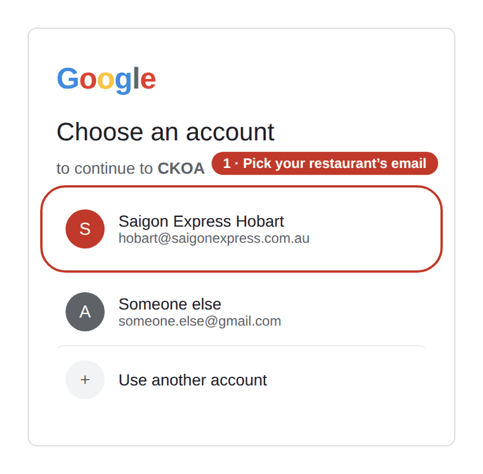
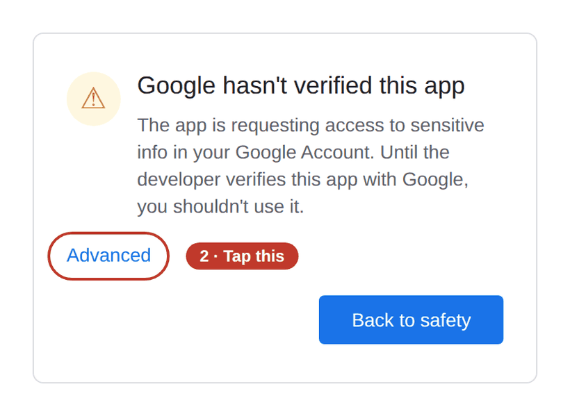
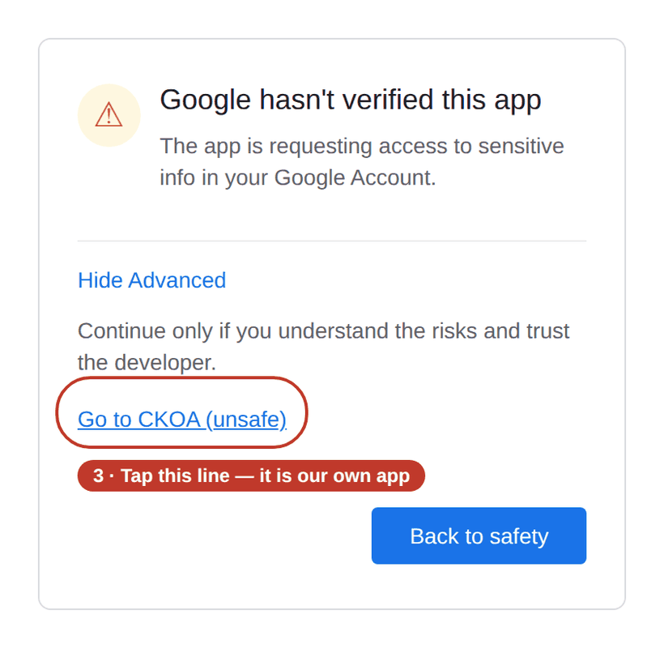
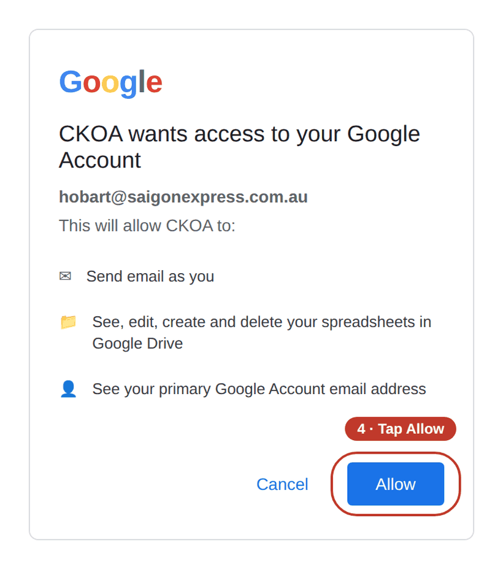
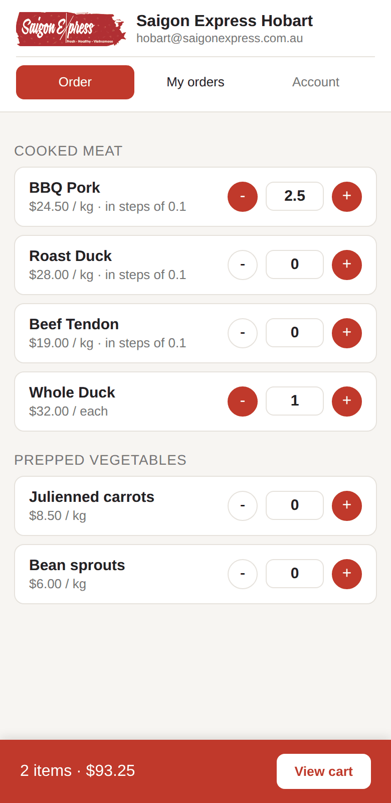
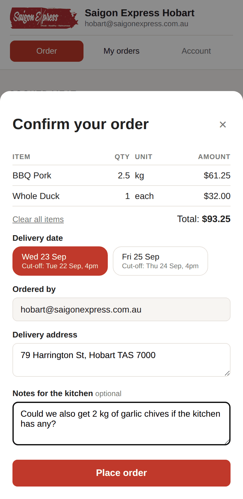
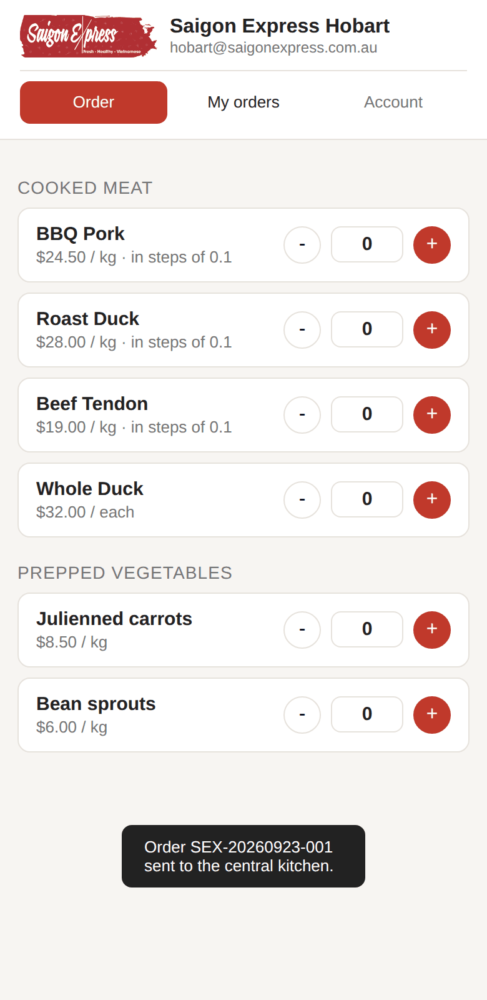
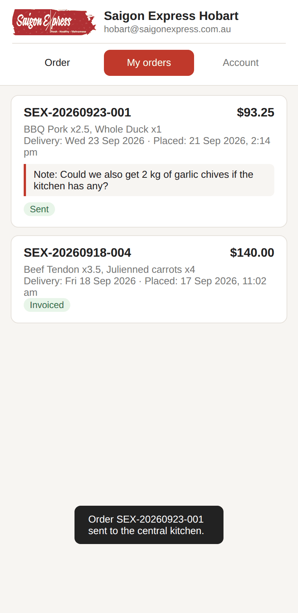
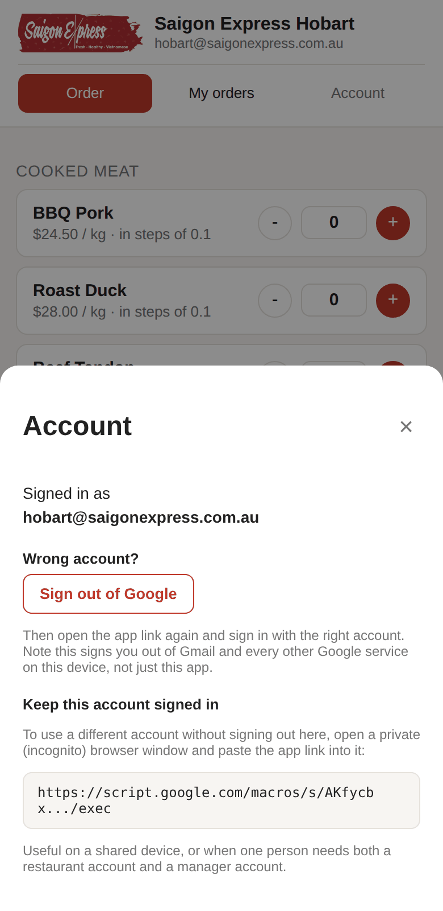
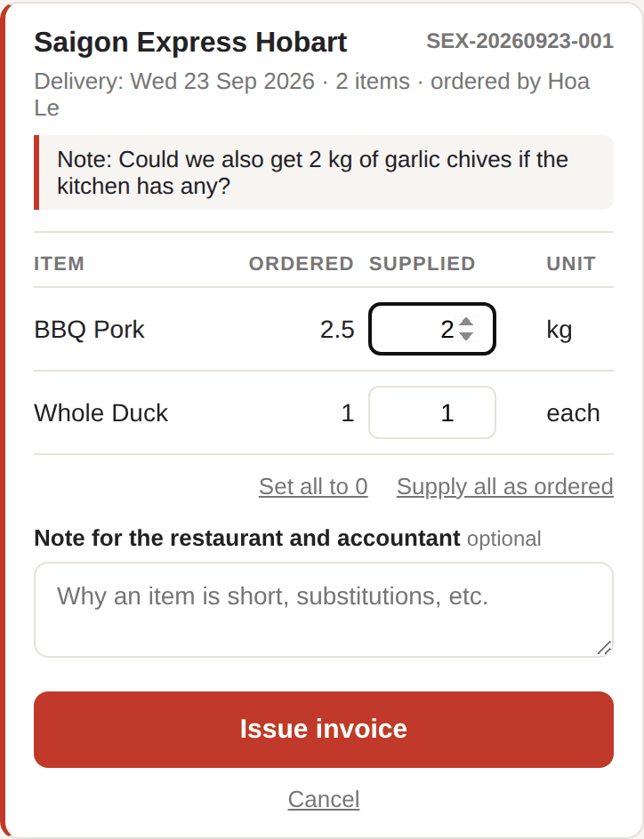

# How to use the ordering app

For **restaurant staff** and the **central kitchen**. No technical knowledge needed — just follow the steps.

This app replaces ordering by text message or phone call: you pick your items, tap send, the central kitchen gets an email straight away, and every order is recorded so it can be checked later.

> **What you need before you start**
> - The app link (your manager will send it to you — keep it somewhere handy)
> - Your restaurant's Google account (email and password)
>
> Works on a phone, tablet or computer. The pictures in this guide were taken on a phone.

---

## Contents

- [Part A — Opening the app for the first time](#part-a--opening-the-app-for-the-first-time)
- [Part B — Placing an order](#part-b--placing-an-order)
- [Part C — Checking your past orders](#part-c--checking-your-past-orders)
- [Part D — If you signed in with the wrong email](#part-d--if-you-signed-in-with-the-wrong-email)
- [Part E — For the central kitchen only](#part-e--for-the-central-kitchen-only)
- [Part F — If something goes wrong](#part-f--if-something-goes-wrong)

---

## Part A — Opening the app for the first time

You only do this **once per phone or computer**. After that, opening the link takes you straight into the app.

The first time, Google asks a few questions and shows **a warning screen that looks alarming**. That is normal for an app a company builds for itself — Google has not "verified" it, which is not the same as the app being unsafe. Just follow the four steps below.

> The four pictures in this part are **illustrations** drawn to make the steps clear. Google's real screens may word things slightly differently, but the buttons are in the same places.

### Step 1 — Tap the link, then pick your restaurant's email

If the device is signed in to several Google accounts, make sure you pick **your own restaurant's email**. Pick the wrong one and the app will show an error — see [Part D](#part-d--if-you-signed-in-with-the-wrong-email) to switch.

### Step 2 — At the warning screen, tap **Advanced**

Do not tap **Back to safety** — tap the small **Advanced** link at the bottom left.

### Step 3 — Tap **Go to … (unsafe)**

The word *(unsafe)* sounds alarming, but here it only means "Google has not verified this app". This is our own company's app.

### Step 4 — Tap **Allow**

Google asks whether the app may send email and write to a spreadsheet — that is exactly how it sends your order to the central kitchen and keeps a record of it. Tap **Allow**.

The list of permissions may be longer or shorter depending on the device. That is fine.

✅ **Done.** The app opens and you can start ordering. From now on the link takes you straight in without asking again.

### Worth doing: add the app to your home screen

So you never have to hunt for the link:

- **iPhone (Safari)**: tap the share button ⬆️ at the bottom → scroll down and choose **Add to Home Screen**
- **Android (Chrome)**: tap the ⋮ button at the top right → choose **Add to Home screen**

The app then sits on your home screen like any other app.

---

## Part B — Placing an order

### Step 1 — Choose your items and quantities

Tap **+** and **−** to change the quantity. Once an item's quantity is above zero, its **−** button turns red, so you can see at a glance what you have chosen.

**Items sold by weight can be ordered in part-units.** Items showing *"in steps of 0.1"* under the price (usually the cooked meats) can be ordered as 0.5 kg, 1.3 kg, 2.5 kg and so on. For those items:

> 💡 **Don't tap + dozens of times.** To order 2.5 kg, **tap the quantity box and type `2.5`**. Much faster.

Items with no *"in steps of…"* line (Whole Duck, for example — sold by the bird) can only be ordered in whole numbers: 1, 2, 3…

The red bar along the bottom always shows **how many items you have chosen** and the **running total**. Tap **View cart** to review the order.

### Step 2 — Check the cart and fill in the delivery details

On this screen:

- **The item table** — check the quantities and amounts. Tap **Clear all items** to empty the cart and start again.
- **Delivery date** — the app only offers the **two nearest delivery dates** still open for ordering. Tap the one you want. The small *Cut-off* line underneath is the **deadline** for that date.
- **Ordered by** — filled in automatically; you don't type it.
- **Delivery address** — pre-filled with your restaurant's address. Change it if the delivery needs to go somewhere else that day.
- **Notes for the kitchen** — optional. This is where you **ask for anything that isn't on the list**, or add any other instructions. For example: *"Could we also get 2 kg of garlic chives if the kitchen has any?"*

> ⏰ **Orders close at 4pm the day before delivery.**
> For a Wednesday delivery, order by 4pm Tuesday. For a Friday delivery, order by 4pm Thursday.
> After the cut-off, that date **disappears from the list** and you can only choose the next delivery day.

### Step 3 — Tap **Place order**

The cart empties and a black message appears with your **order number** (for example `SEX-20260923-001`). That is how you know the order went through.

At the same time the app emails the central kitchen with your restaurant name, who ordered, the delivery date and address, the item list and your notes. **You never have to write the email yourself.**

Whoever placed the order gets a copy of that email too — check your inbox if you want to be sure it went out.

---

## Part C — Checking your past orders

Tap the **My orders** tab at the top.

Each order shows its number, total, items, delivery date, when it was placed, any notes, and a **status label** at the bottom:

| Label | What it means |
|---|---|
| **Sent** | The order has gone through; the central kitchen has not invoiced it yet |
| **Invoiced** | The central kitchen has delivered and invoiced this order |

Each restaurant only sees its own orders, never another restaurant's.

> **Ordered something by mistake?** There is no cancel button. Call or message the central kitchen directly, then place a new order.

---

## Part D — If you signed in with the wrong email

What you'll see: the app says it doesn't recognise you, or it opens but shows **a different restaurant's** name.

Tap the **Account** tab at the top. (If you are stuck on the error screen, the same panel is already there.)

Two ways to fix it:

**Option 1 — Switch to the other account for good.** Tap **Sign out of Google**, then open the app link again and sign in with the right email.

⚠️ This signs you out of **every Google service on that device** (Gmail, Drive, YouTube…), not just this app. On a shared device, consider option 2 instead.

**Option 2 — Keep the current account signed in.** Open a **private (incognito) window** and paste the app link into it. Handy when one person needs both a restaurant account and a manager account, or when several people share a device.

- **iPhone (Safari)**: tap the two-squares button at the bottom right → **Private**
- **Android (Chrome)**: tap ⋮ → **New Incognito tab**

---

## Part E — For the central kitchen only

The central kitchen manager sees two different tabs: **To fulfil** (orders to prepare) and **Invoiced** (orders already invoiced) — and no ordering tab.

The job here is to **record what was actually supplied**, because sometimes the kitchen cannot fill an order completely.

On the **To fulfil** tab, tap **Fulfil this order** on the order you are working on:

- The **Ordered** column is what the restaurant asked for. The **Supplied** column is **what the kitchen actually sent** — change it if anything was short.
- You cannot enter more than was ordered. Items sold by weight accept part-units here too (2.5, 1.3…), the same as on the restaurant side.
- Two shortcuts: **Supply all as ordered** and **Set all to 0**.
- The **Note** box is for explaining why something was short, or what was substituted. It appears on the invoice, where both the accountant and the restaurant can read it.
- Tap **Issue invoice**. The app asks you to confirm, then emails the invoice to the accountant and the restaurant, with a PDF copy attached.

> **The invoice bills what was supplied, not what was ordered.** Anything short is printed in red with the shortfall shown, so the accountant can reconcile it easily.

Once invoiced, the order moves from **To fulfil** to **Invoiced**. Invoices **cannot be edited afterwards**, so check the quantities before tapping.

---

## Part F — If something goes wrong

| What you see | What to do |
|---|---|
| The **"Google hasn't verified this app"** warning | Normal the first time. Follow [Part A, steps 2–4](#step-2--at-the-warning-screen-tap-advanced). |
| It says your **email isn't recognised** | You're signed in with the wrong account, or your manager hasn't added this email to the list yet. See [Part D](#part-d--if-you-signed-in-with-the-wrong-email); if it still fails, tell your manager. |
| The app shows **a different restaurant** | Wrong email. See [Part D](#part-d--if-you-signed-in-with-the-wrong-email). |
| **No delivery dates** to choose from | Both of the next delivery dates are past their 4pm cut-off. Check again later, or call the central kitchen if it's urgent. |
| The delivery date you want **isn't listed** | The app only offers the two nearest dates still open. Dates further out become available closer to the time. |
| You need an item **that isn't on the list** | Write it in the **Notes for the kitchen** box when you order. |
| You tapped **Place order** but **saw no confirmation** | Check your internet connection, then look under **My orders** to see whether it went through. If it isn't there, order again. |
| A price shows **$0.00** | Your manager hasn't entered a price for that item yet. You can still order it. |
| Items **missing, or the price looks wrong** | Tell your manager — items and prices are maintained in the spreadsheet, and the app picks up changes straight away. |
| The app **won't open / the page is blank** | Close the browser completely and open the link again. If that doesn't work, try another device and tell your manager. |

---

## Key things to remember

1. **Orders close at 4pm the day before delivery.** Wednesday delivery → order by 4pm Tuesday. Friday delivery → order by 4pm Thursday.
2. **For items sold by weight, type the number straight into the box** — `2.5`, for instance. Don't tap + dozens of times.
3. **Need something unusual? Put it in the Notes box** — the central kitchen reads it.
4. **Check the order carefully before tapping Place order** — there is no cancel button.
5. **There is no separate login or logout.** The app follows whichever Google account is signed in on the device.

---

*Setup and administration (for the admin) is covered in [SETUP.md](./SETUP.md). Vietnamese version of this guide: [HUONG-DAN-SU-DUNG.md](./HUONG-DAN-SU-DUNG.md).*
